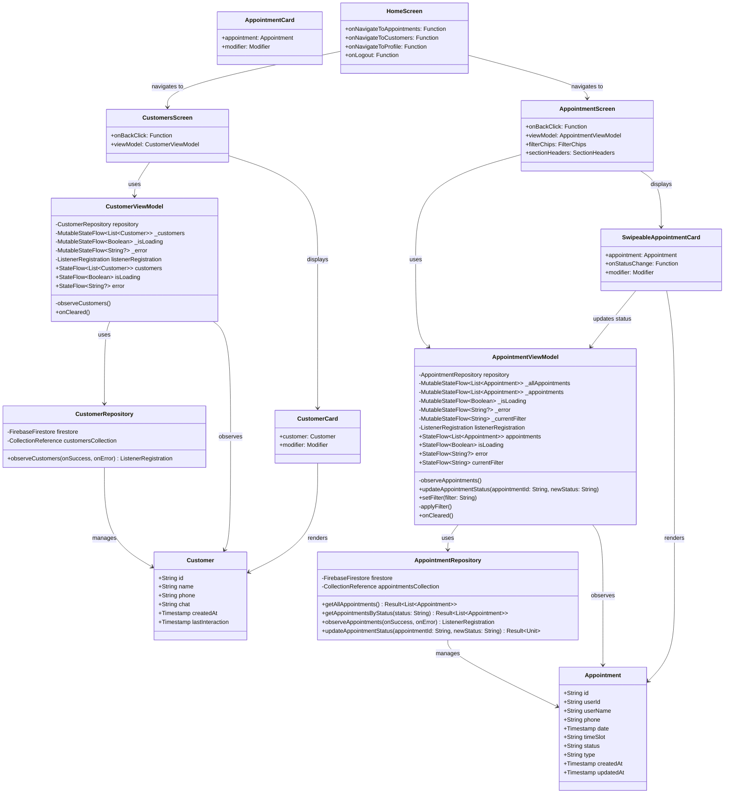

# Class Diagram - Barber Project

## Architecture Overview

### Data Layer
- **Models**: Define data structures matching Firestore collections
  - `Appointment`: Represents appointment documents
  - `Customer`: Represents chatbot_users documents

- **Repositories**: Handle Firestore operations
  - `AppointmentRepository`: CRUD and real-time listeners for appointments
  - `CustomerRepository`: Real-time listeners for customers

### Business Logic Layer
- **ViewModels**: Manage state and business logic
  - `AppointmentViewModel`: Handles appointment state with real-time updates
  - `CustomerViewModel`: Handles customer state with real-time updates

### UI Layer
- **Atoms**: Basic UI elements (buttons, avatars, etc.)
- **Molecules**: Simple component combinations
  - `AppointmentCard`: Displays appointment information
  - `CustomerCard`: Displays customer information
- **Screens**: Complete screen compositions
  - `AppointmentScreen`: List of appointments with real-time updates
  - `CustomersScreen`: List of customers with real-time updates
  - `HomeScreen`: Main navigation hub

## Real-time Updates Flow

1. ViewModel initializes and calls repository's `observe` method
2. Repository sets up Firestore `addSnapshotListener`
3. When data changes in Firestore:
   - Listener callback is triggered
   - Repository parses documents into models
   - Success callback updates ViewModel's StateFlow
4. Screen composables observe StateFlow
5. UI automatically recomposes with new data

## State Management

All screens follow a consistent state pattern:
- `isLoading`: Shows loading spinner during initial data fetch
- `error`: Displays error message if Firestore operation fails
- `data` (appointments/customers): The actual data list
- Empty state: Friendly message when no data exists

### Appointment Screen State Management
- `currentFilter`: Tracks which filter is active (active, cancelled, completed)
- Filtered appointments are sorted with processing first, then pending
- Swipe gestures update status in real-time through ViewModel

## Swipe-to-Action Feature

### Swipe Behavior by Status:
- **Pending Appointments**:
  - Swipe right → Changes to "processing"
  - Swipe left → Changes to "cancelled"
  
- **Processing Appointments**:
  - Swipe right → Changes to "completed"
  - Swipe left → Changes to "cancelled"

### Visual Feedback:
- Background color appears when swiping (blue for right, red for left)
- Icons and labels show the action being performed
- Smooth animation returns card to position after release
- Threshold of 200px must be crossed to trigger action

## Filtering System

Three filter chips allow users to view different appointment sets:
1. **Activas** (Active): Shows pending and processing appointments
2. **Canceladas** (Cancelled): Shows cancelled appointments only
3. **Completadas** (Completed): Shows completed appointments only

Active filter displays appointments in sections:
- "En Proceso" section appears first with count
- "Pendientes" section appears second with count

